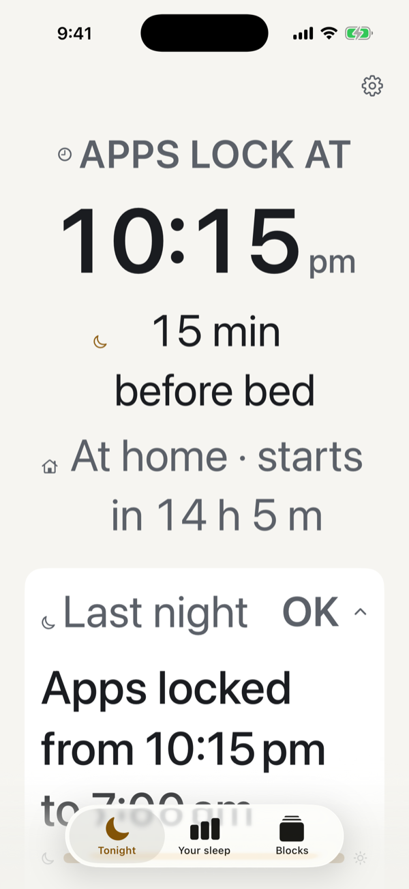

# Renders

Commit `f7949fe` · 2026-11-28 04:43 UTC · Xcode 26.6 · iPhone-17 iOS-26-5

Each folder holds screen.png, ui.json (accessibility tree), log.txt (app log), launch.txt, and any
crash report. Where the time went: timings.txt.

| Scenario | light | dark | ax5 | wordless |
|---|---|---|---|---|
| `home-evening` |  |  |  |  |
| `home-morning-open` |  |  |  |  |
