# Renders

Commit `7bf5f3b` · 2026-11-28 05:34 UTC · Xcode 26.6 · iPhone-17 iOS-26-5

Each folder holds screen.png, ui.json (accessibility tree), log.txt (app log), launch.txt, and any
crash report. Where the time went: timings.txt.

| Scenario | light | dark | ax5 | wordless |
|---|---|---|---|---|
| `sleep-health-improving` | 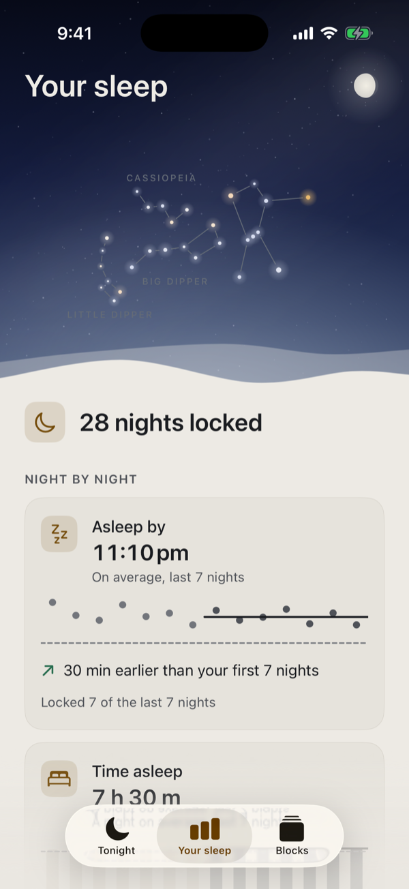 |  | 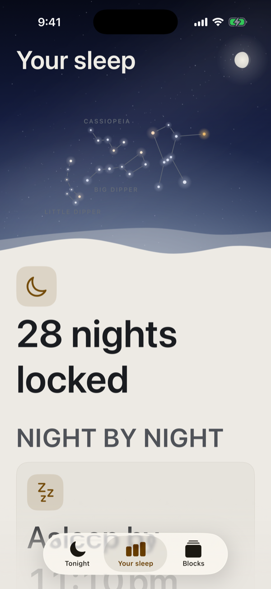 | 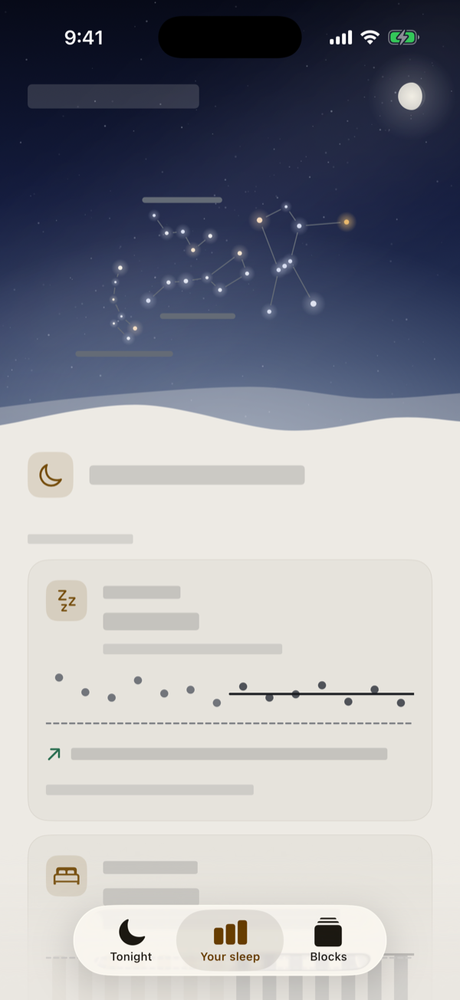 |
| `sleep-health-noisy` | 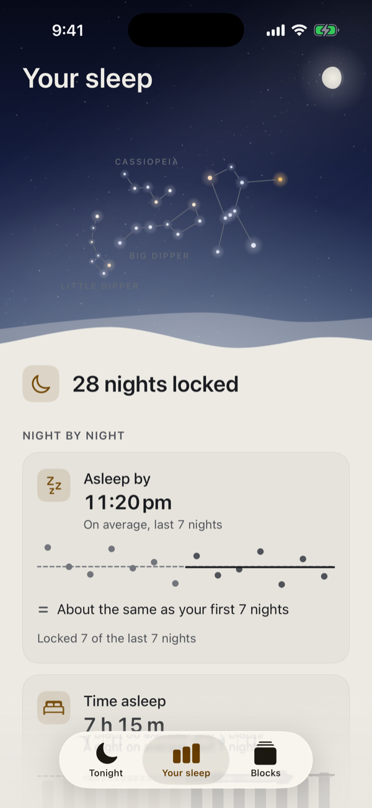 | 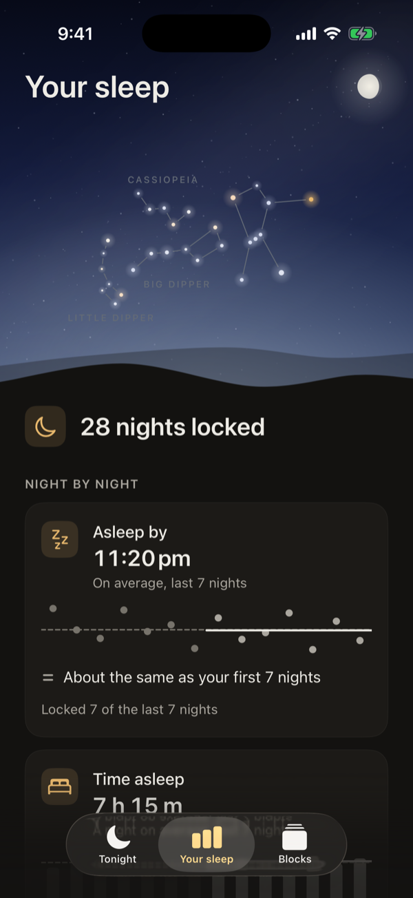 |  |  |
| `sleep-dusk` | 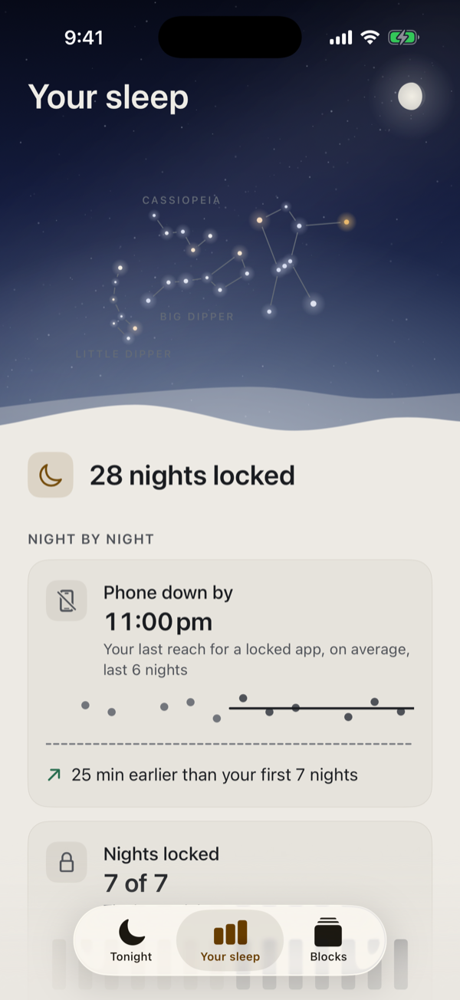 | 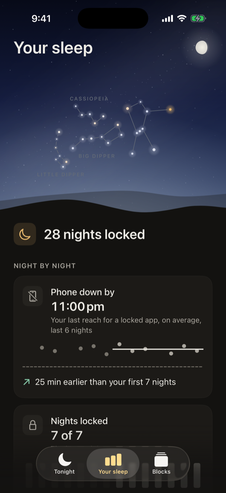 | 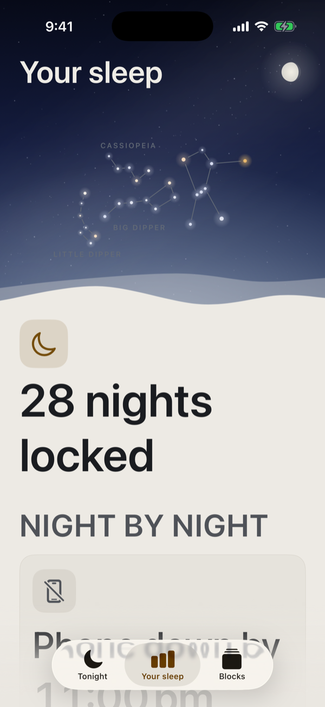 | 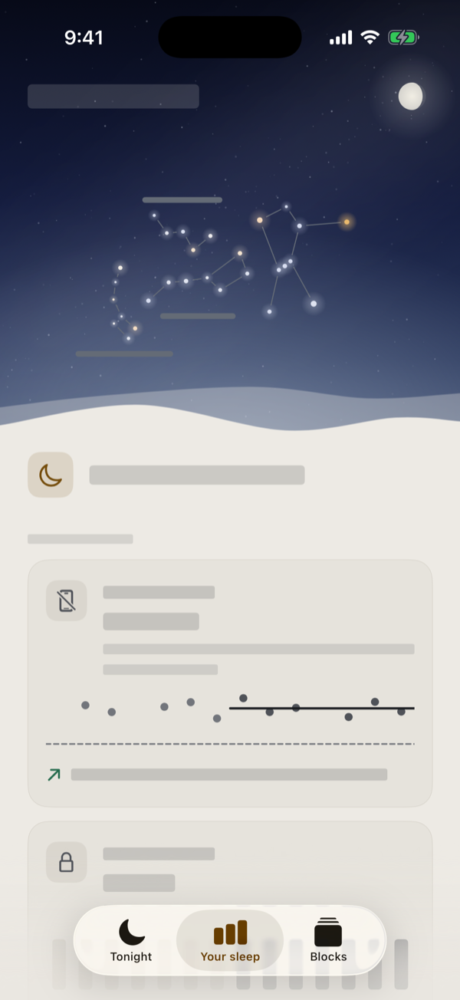 |
| `sleep-few` | 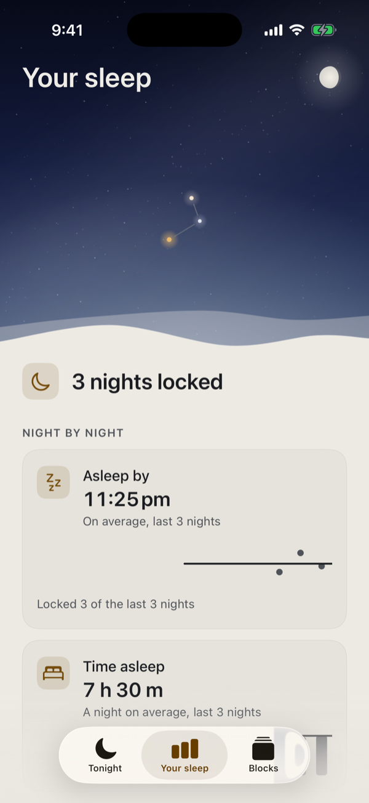 | 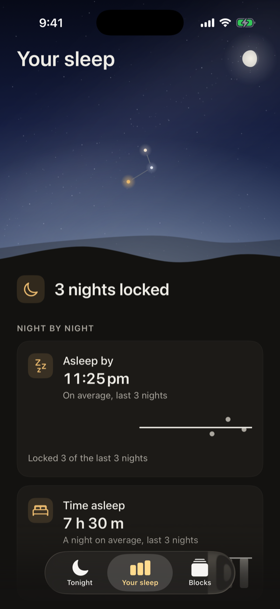 | 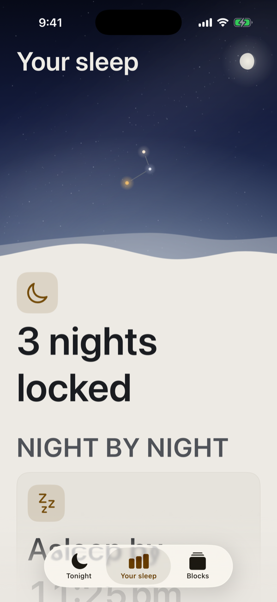 | 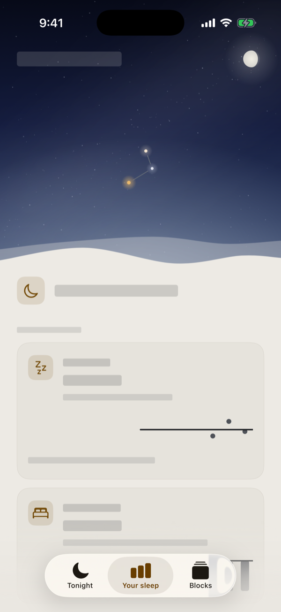 |
| `sleep-health-flat` | 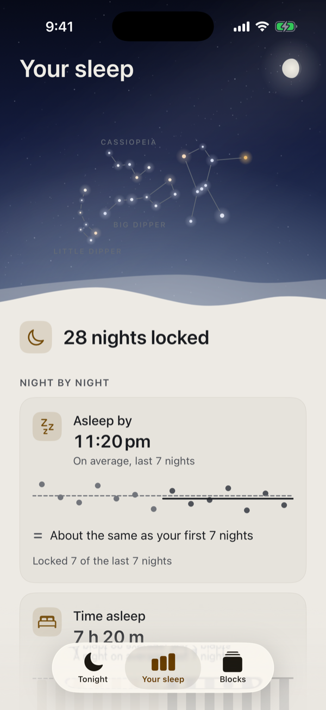 |  |  | 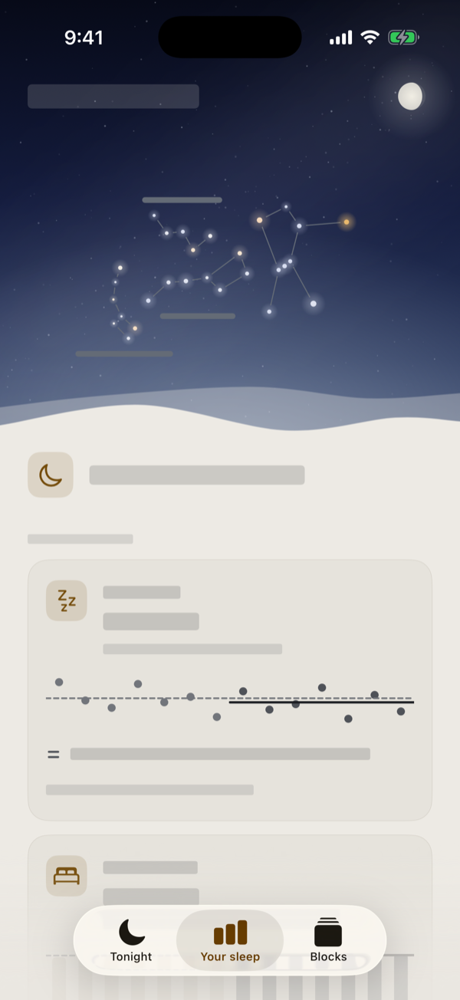 |
