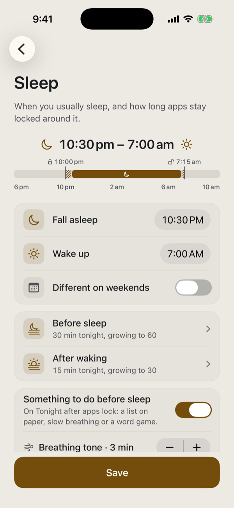
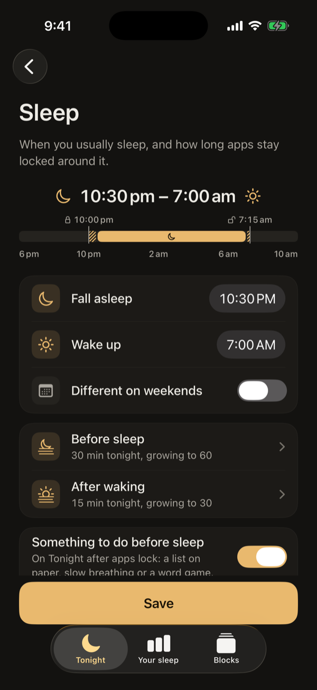
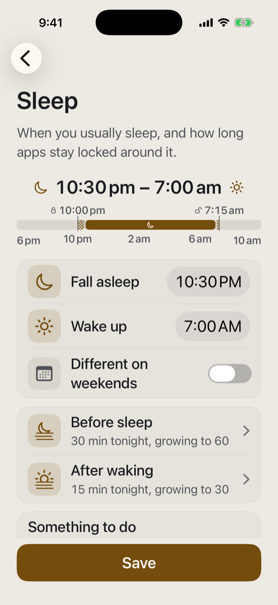
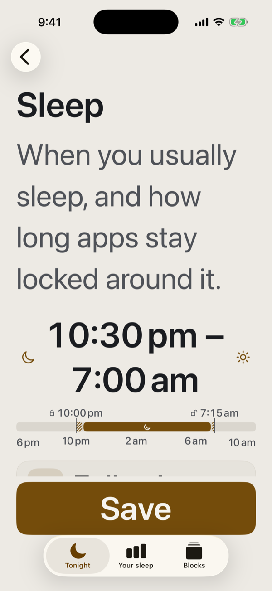
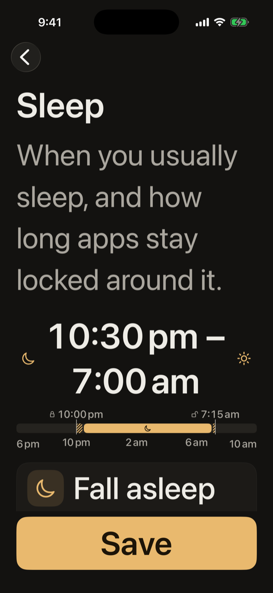
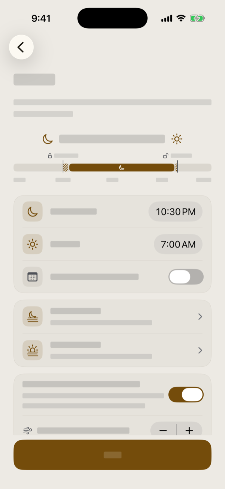
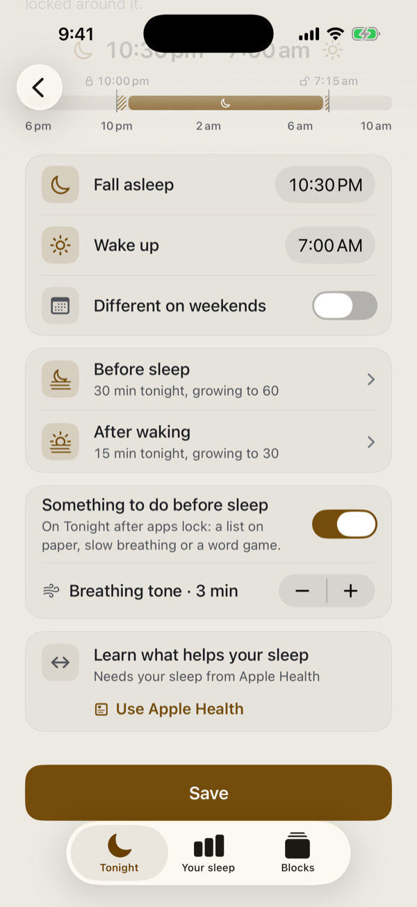
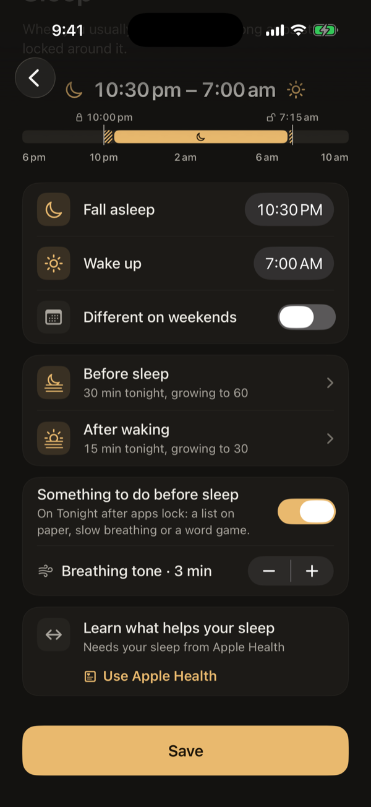
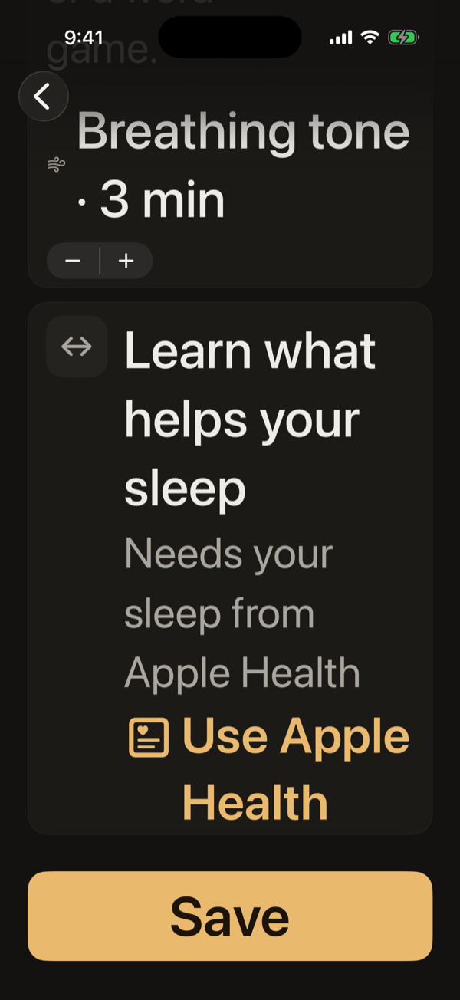
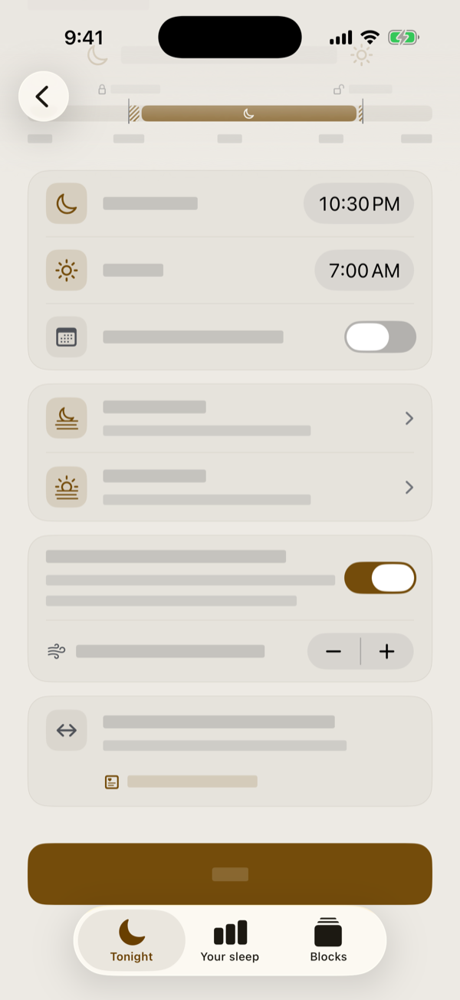

# Renders

Commit `ec97b6b` · 2026-11-28 18:37 UTC · Xcode 26.6 · iPhone-17 iOS-26-5

Each folder holds screen.png, ui.json (accessibility tree), log.txt (app log), launch.txt, and any
crash report. Where the time went: timings.txt.

| Scenario | light | dark | xxxl | ax5 | dark-ax5 | wordless |
|---|---|---|---|---|---|---|
| `settings-sleep` |  |  |  |  |  |  |
| `settings-sleep: swipe --start-x 200 --start-y 500 --end-x 200 --end-y 100 --duration 0.15; swipe --start-x 200 --start-y 500 --end-x 200 --end-y 100 --duration 0.15; swipe --start-x 200 --start-y 500 --end-x 200 --end-y 100 --duration 0.15; swipe --start-x 200 --start-y 500 --end-x 200 --end-y 100 --duration 0.15; swipe --start-x 200 --start-y 500 --end-x 200 --end-y 100 --duration 0.15; swipe --start-x 200 --start-y 500 --end-x 200 --end-y 100 --duration 0.15; swipe --start-x 200 --start-y 500 --end-x 200 --end-y 100 --duration 0.15; swipe --start-x 200 --start-y 500 --end-x 200 --end-y 100 --duration 0.15` |  |  |  |  |  |  |
