# Renders

Commit `6b240eb` · 2026-11-28 00:56 UTC · Xcode 26.6 · iPhone-17 iOS-26-5

Each folder holds screen.png, ui.json (accessibility tree), log.txt (app log), launch.txt, and any
crash report. Where the time went: timings.txt.

| Scenario | light | dark | wordless | ax5 |
|---|---|---|---|---|
| `home-evening` |  |  |  |  |
| `home-blocked` |  | 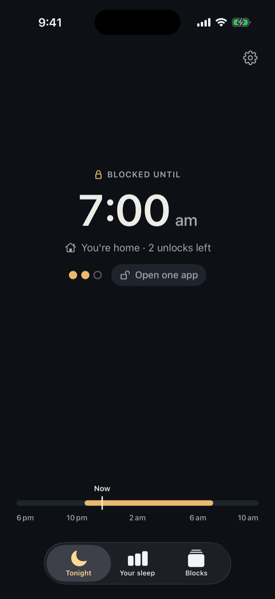 |  |  |
| `home-away` | 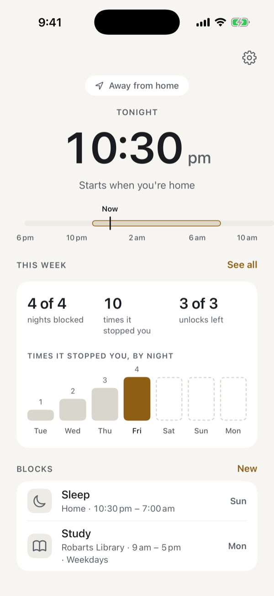 | 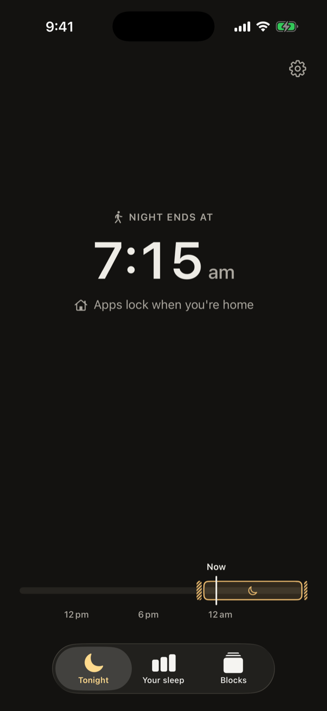 |  | 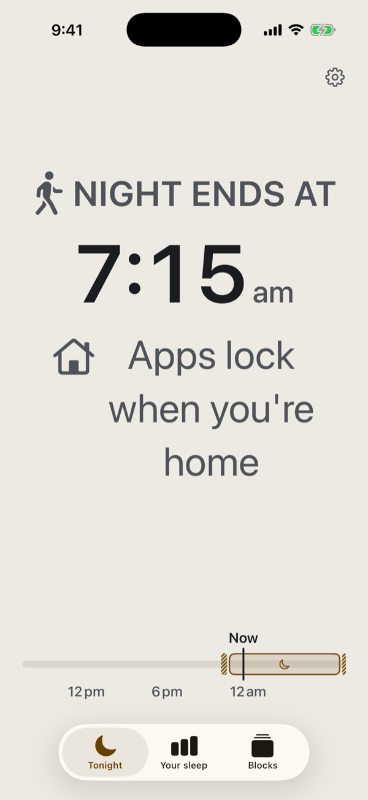 |
| `home-pause-open` |  | 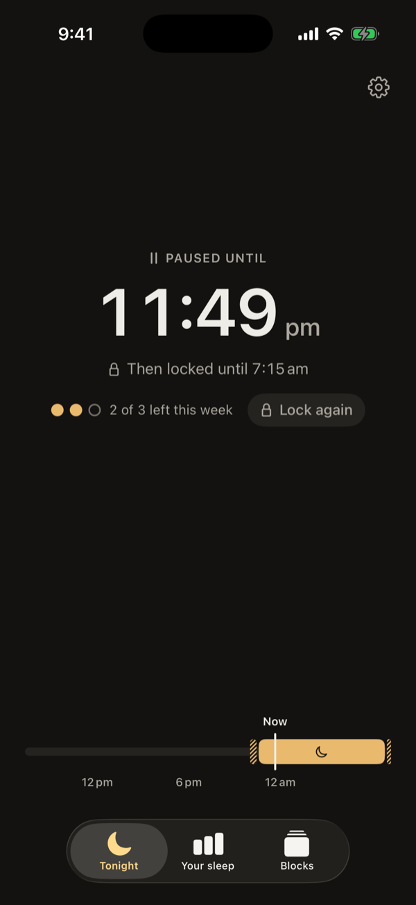 | 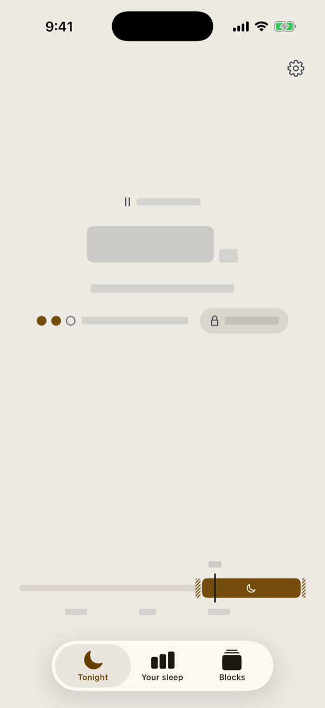 | 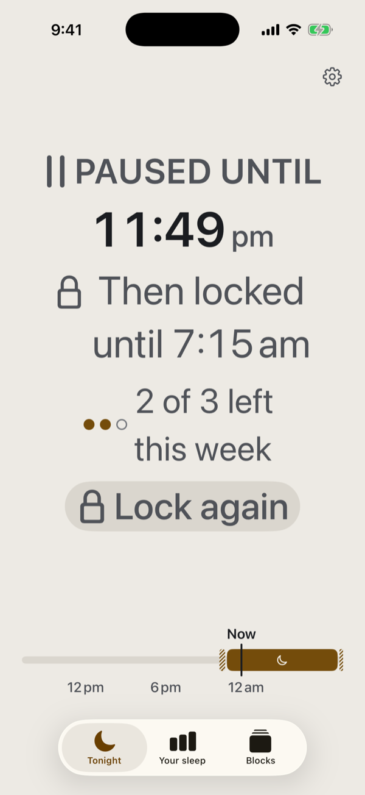 |
| `home-read-only` |  |  | 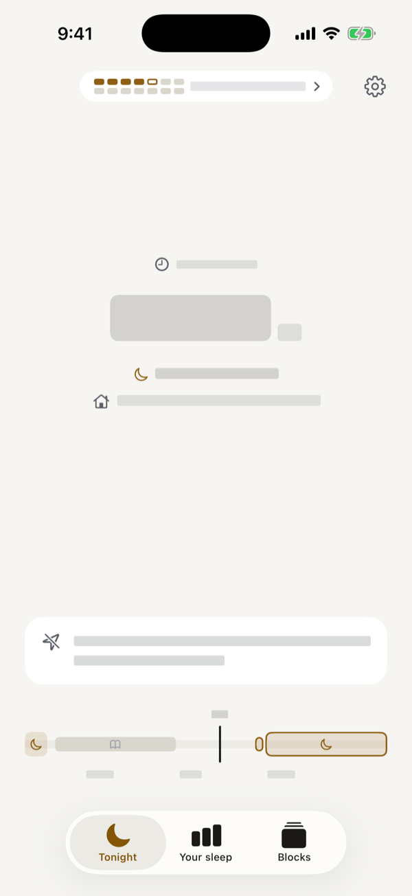 |  |
| `home-recovered` | 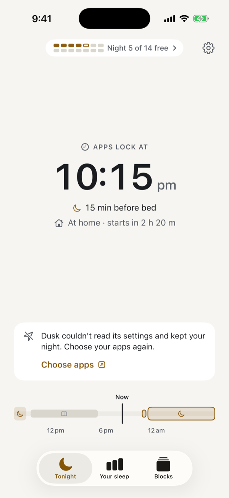 |  |  |  |
| `home-paused` |  |  |  | 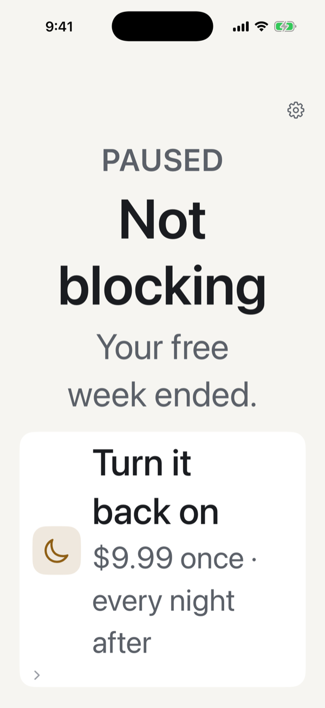 |
| `home-screen-time-off` |  |  |  |  |
| `home-no-blocks` | 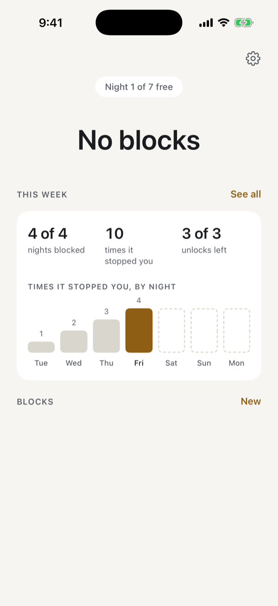 | 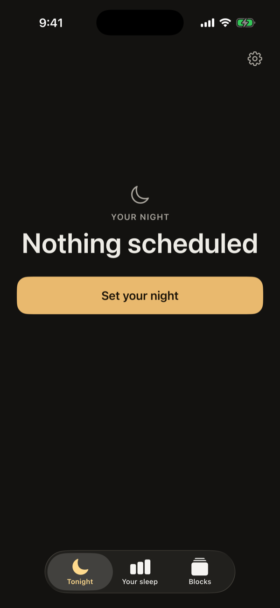 | 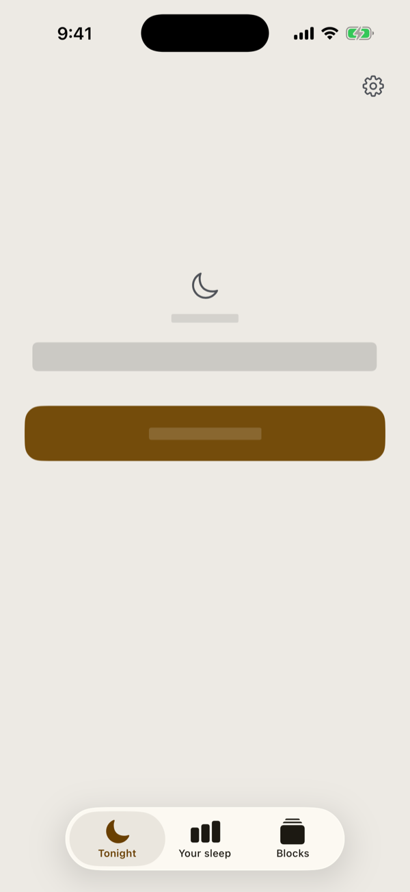 | 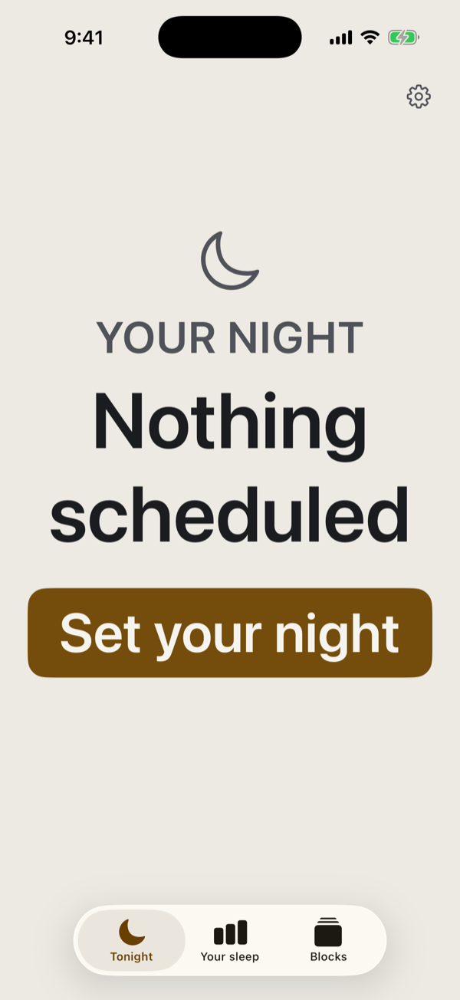 |
