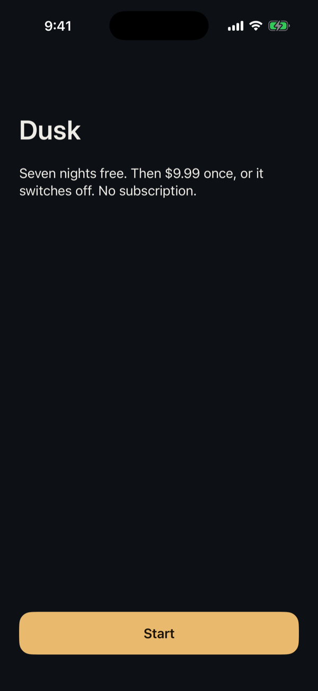
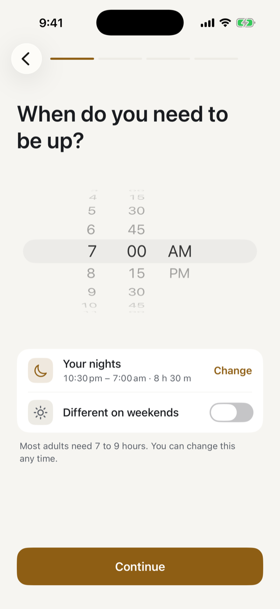
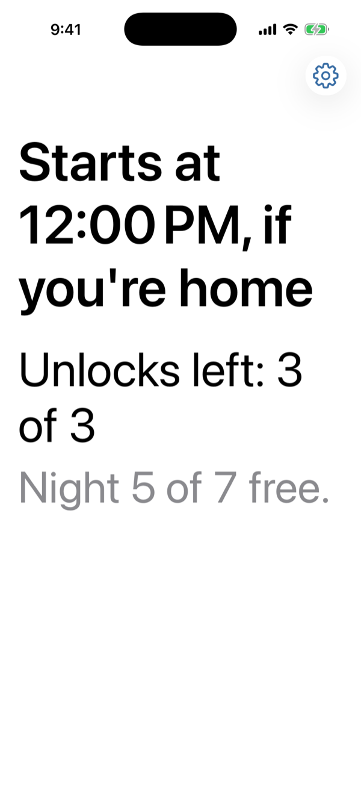
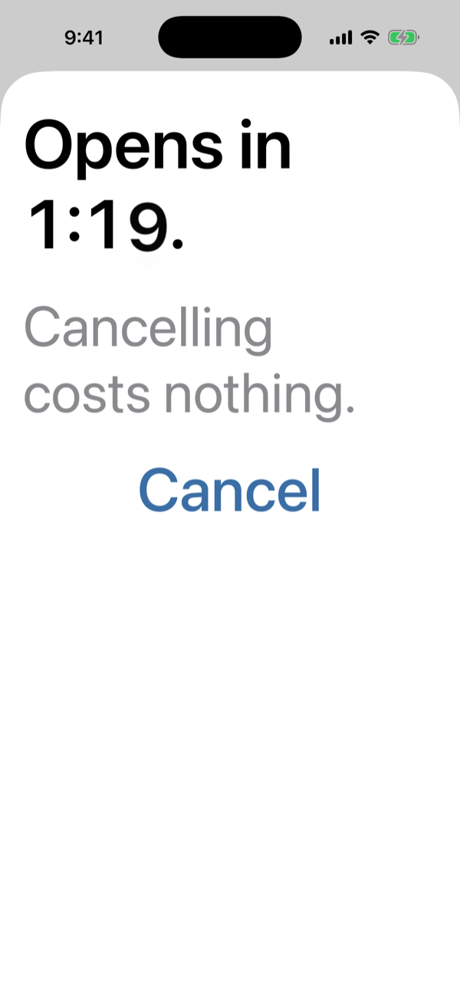
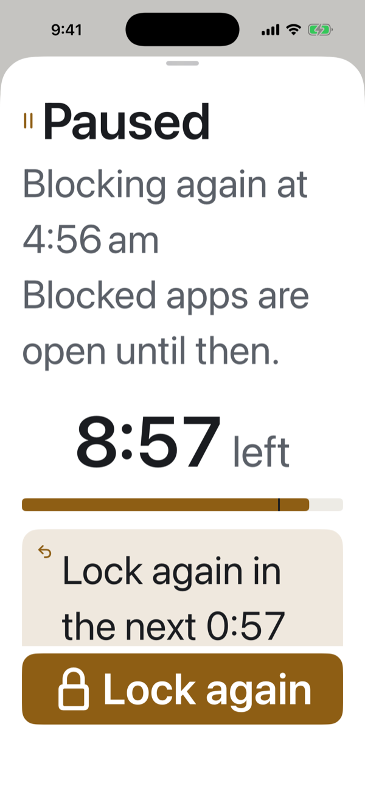
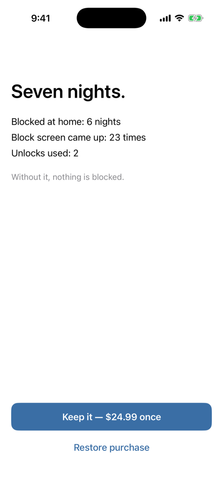
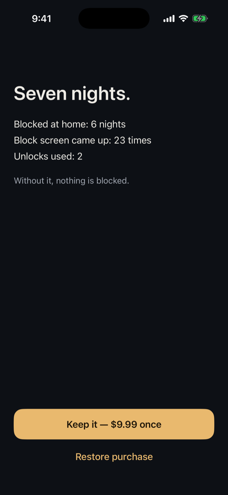
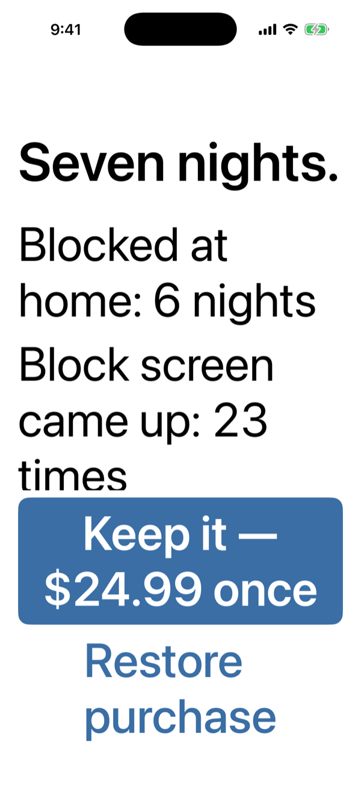

# Renders

Commit `f9c7a5a` · 2026-11-17 23:18 UTC · Xcode 26.6 · iPhone-17 iOS-26-5

Each folder holds screen.png, ui.json (accessibility tree), log.txt (app log), launch.txt, and any
crash report. Where the time went: timings.txt.

| Scenario | light | dark | ax5 |
|---|---|---|---|
| `welcome` |  |  |  |
| `wake` |  |  |  |
| `ready` |  |  |  |
| `status-starts` |  |  |  |
| `door-waiting` |  |  |  |
| `door-open` |  |  |  |
| `trial-ended` |  |  |  |
