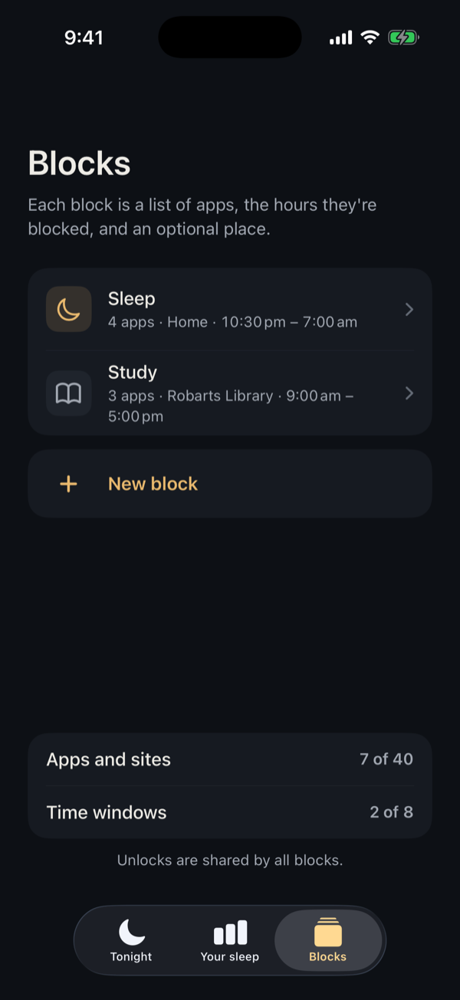

# Renders

Commit `2032129` · 2026-11-20 18:16 UTC · Xcode 26.6 · iPhone-17 iOS-26-5

Each folder holds screen.png, ui.json (accessibility tree), log.txt (app log), launch.txt, and any
crash report. Where the time went: timings.txt.

| Scenario | dark |
|---|---|
| `blocks` |  |
| `block-edit` |  |
| `home-location` |  |
