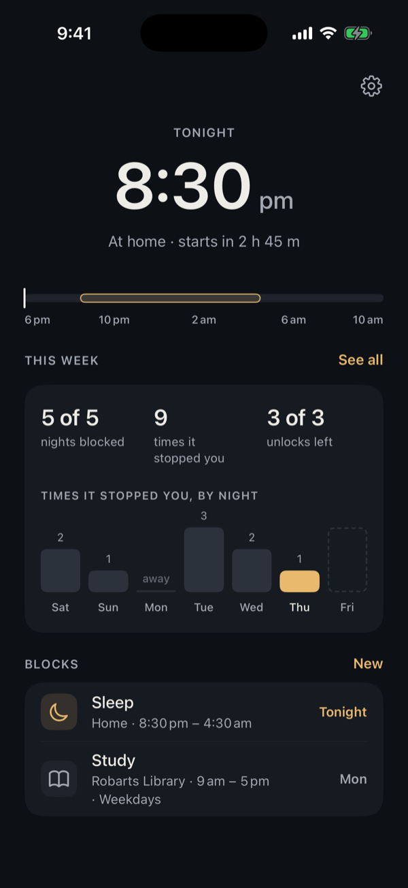
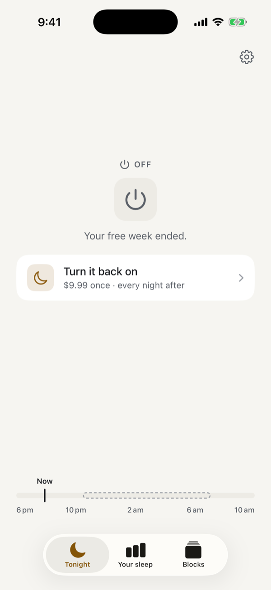

# Renders

Commit `1906ecb` · 2026-11-20 17:49 UTC · Xcode 26.6 · iPhone-17 iOS-26-5

Each folder holds screen.png, ui.json (accessibility tree), log.txt (app log), launch.txt, and any
crash report. Where the time went: timings.txt.

| Scenario | dark | light | ax5 |
|---|---|---|---|
| `home-evening` |  |  |  |
| `home-blocked` |  |  |  |
| `home-first-week` |  |  |  |
| `home-week` |  |  |  |
| `home-paused` |  |  |  |
