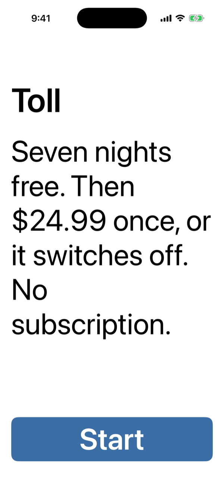
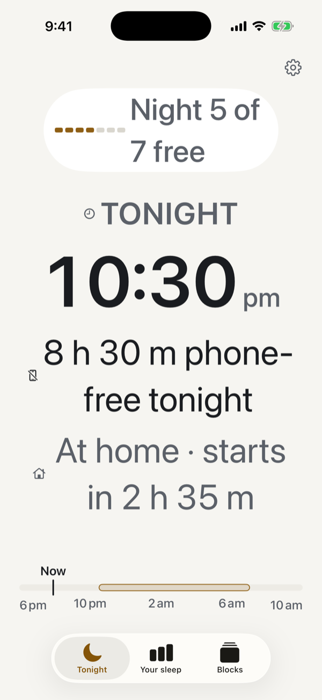
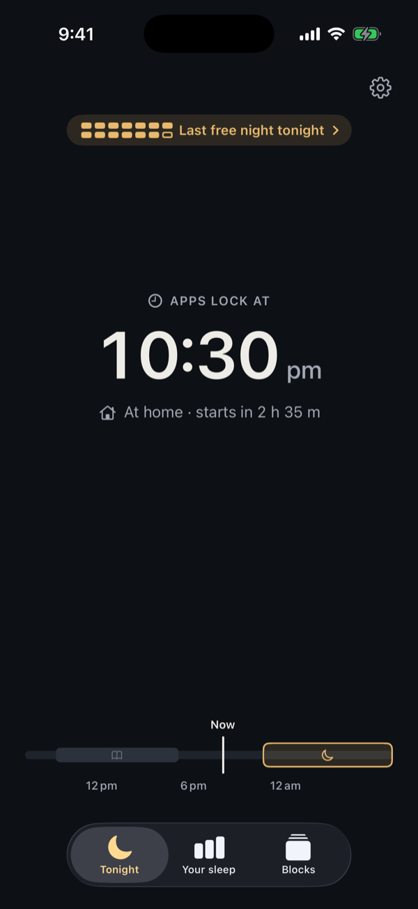
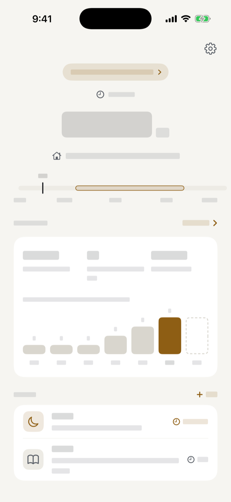
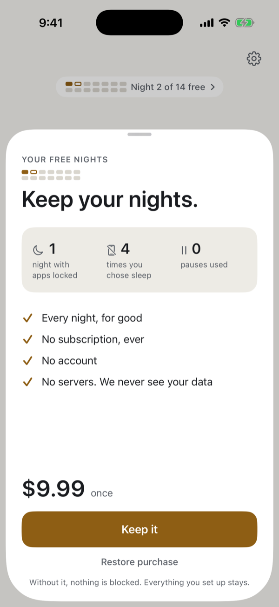
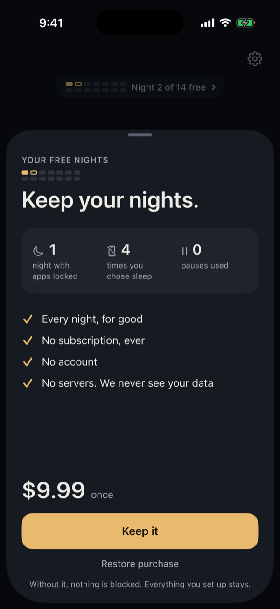
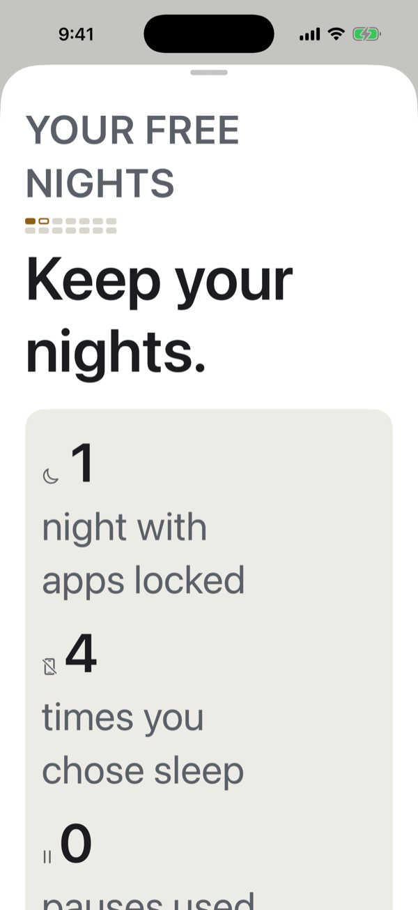
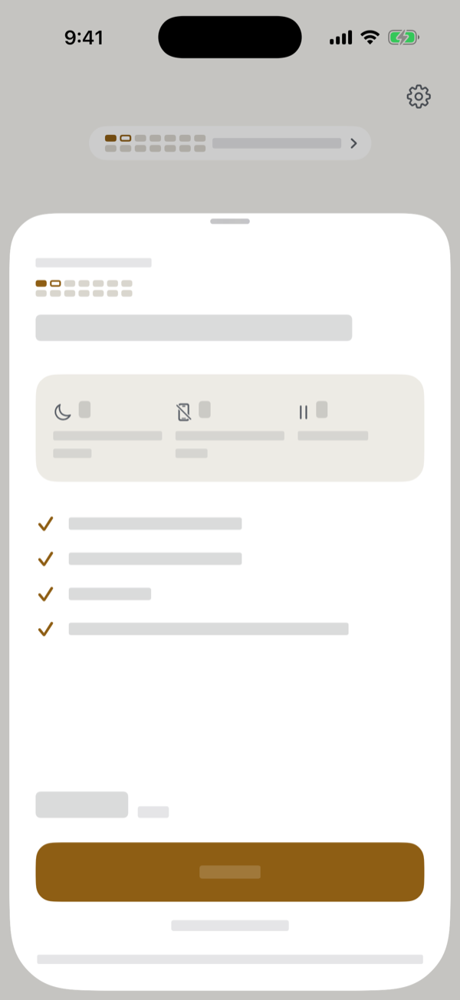
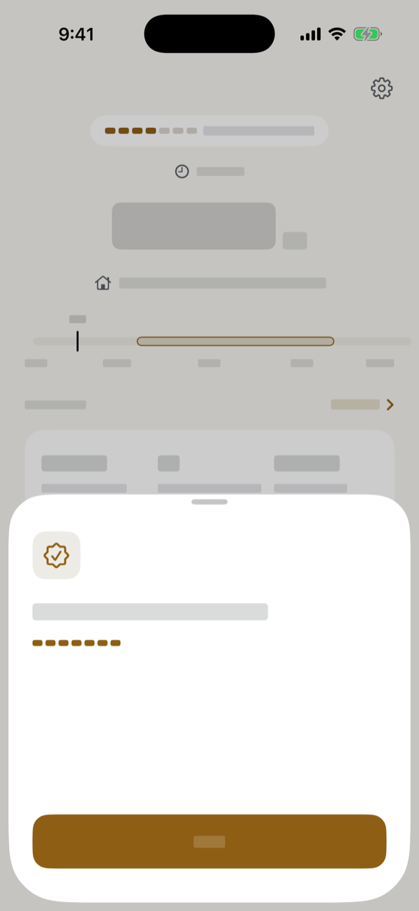

# Renders

Commit `c977fa0` · 2026-11-24 17:01 UTC · Xcode 26.6 · iPhone-17 iOS-26-5

Each folder holds screen.png, ui.json (accessibility tree), log.txt (app log), launch.txt, and any
crash report. Where the time went: timings.txt.

| Scenario | light | dark | ax5 | wordless |
|---|---|---|---|---|
| `welcome` |  |  |  |  |
| `ready` |  |  |  |  |
| `home-evening` |  |  |  |  |
| `home-last-night` |  |  |  |  |
| `home-pill-purchase` |  |  |  |  |
| `purchase` |  |  |  |  |
| `purchase-done` |  |  |  |  |
| `settings` |  |  |  |  |
