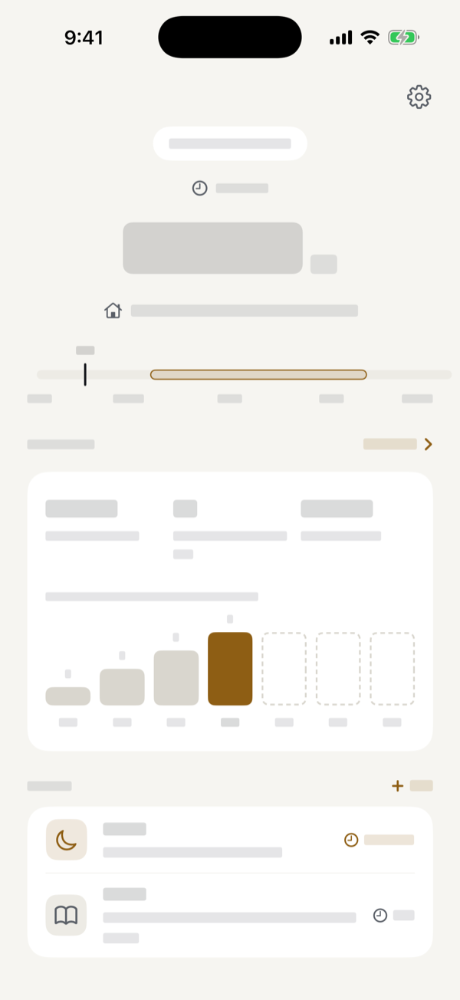
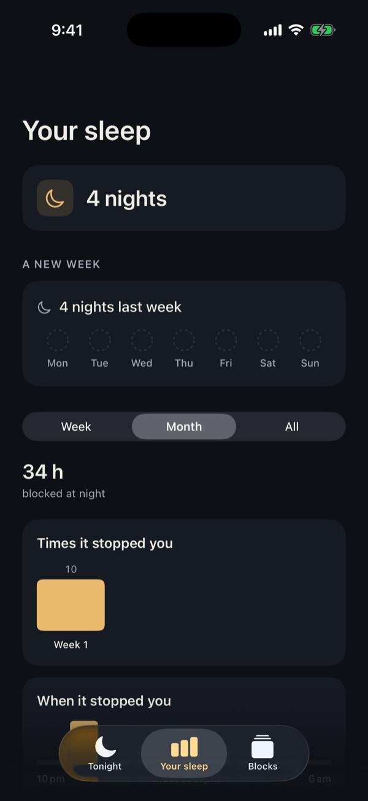
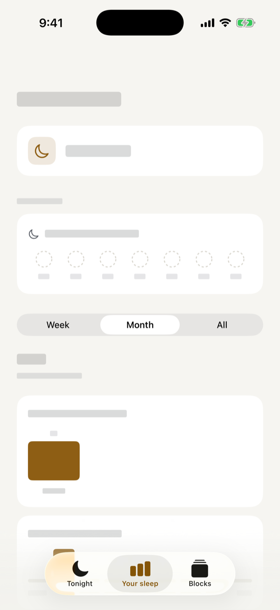
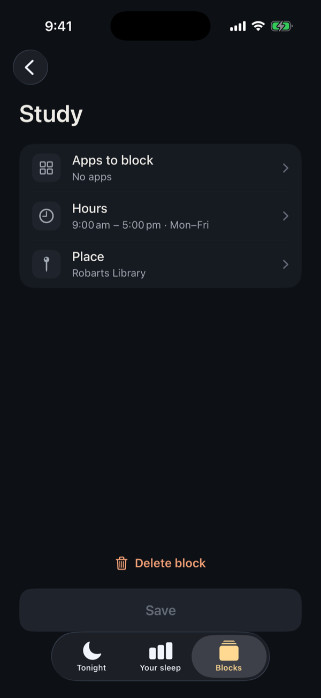

# Renders

Commit `fa940bb` · 2026-11-21 16:22 UTC · Xcode 26.6 · iPhone-17 iOS-26-5

Each folder holds screen.png, ui.json (accessibility tree), log.txt (app log), launch.txt, and any
crash report. Where the time went: timings.txt.

| Scenario | dark | wordless |
|---|---|---|
| `home-blocked` |  |  |
| `home-evening` |  |  |
| `insights` |  |  |
| `blocks` |  |  |
| `block-edit` |  |  |
| `settings` |  |  |
| `door-choosing` |  |  |
